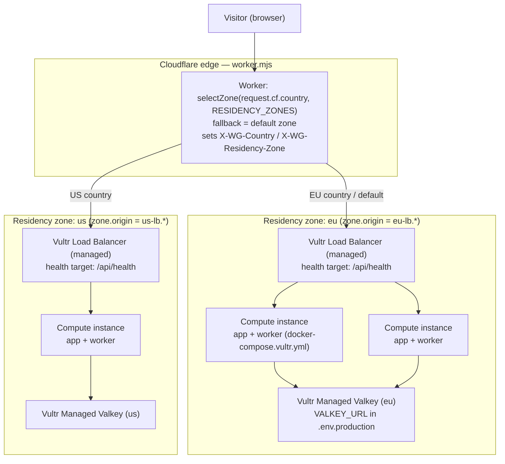
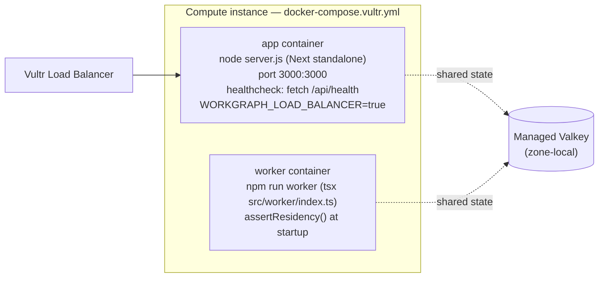
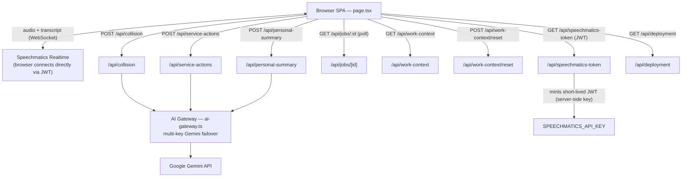
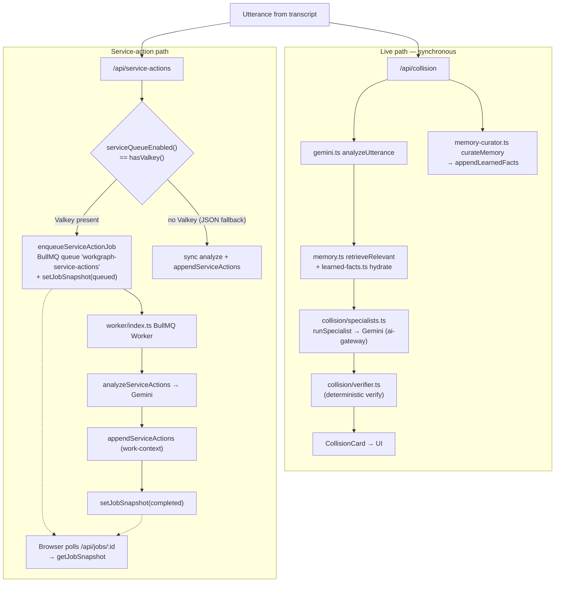
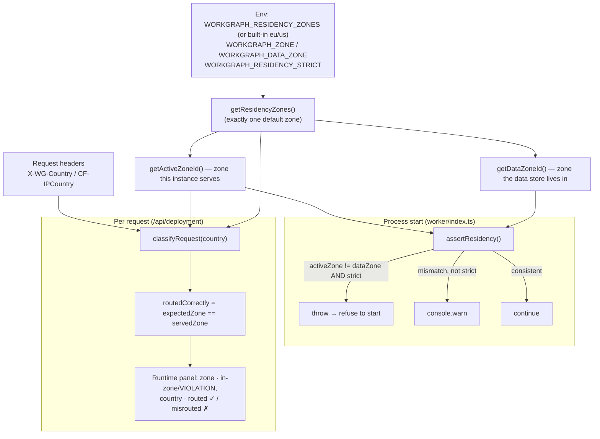
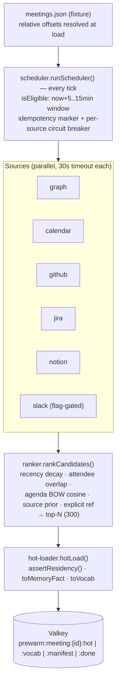

# System Architecture

> Derived **solely from code** at commit `e399a6b` (`main`) **plus the
> uncommitted Pre-Warmer + Transcript Enhancer + Notion integration work** on
> the working tree. Every node/edge below is backed by a cited source file.
> Nothing here is aspirational — if a component isn't in the repo, it isn't in
> the graph, and §12 states plainly what is *wired* vs. *dormant*.
>
> §1–§9 describe the committed system. §10–§11 document the new input-side
> subsystems. §12 is a candid architecture review.

---

## 1. Multi-region topology (with load balancing)

Sources: `deploy/cloudflare/worker.mjs`, `deploy/cloudflare/wrangler.toml`,
`docker-compose.vultr.yml`, `src/lib/residency.ts`, `src/app/api/health/route.ts`.




Key code facts:

- **Cloudflare Worker is the geo-router**, not a balancer. `selectZone()`
(`worker.mjs`) maps `request.cf.country` (or the `CF-IPCountry` header) to a
zone and proxies to `https://<zone.origin>`; unknown/empty country → the
zone flagged `default` (else first). Zone list comes from the
`RESIDENCY_ZONES` Worker var (`wrangler.toml`).
- **The load balancer is Vultr's managed LB, one per zone** — it is *not* in
the repo as code (no nginx/haproxy service exists; `deploy/nginx` was
removed). Its health target is `/api/health`, which returns
`{ ok, time, service }` (`src/app/api/health/route.ts`).
- **Data residency = per-zone Valkey.** `docker-compose.vultr.yml` has **no
`valkey` service** — production Valkey is managed and supplied via
`.env.production` (`VALKEY_URL`), so each zone's data stays in that zone.

---

## 2. One Compute instance (the unit the Vultr LB balances)

Source: `docker-compose.vultr.yml`, `Dockerfile`, `package.json`.




- Both containers run the same image (`workgraph-ai`), share the
`x-residency` env anchor (`WORKGRAPH_ZONE`, `WORKGRAPH_DATA_ZONE`,
`WORKGRAPH_RESIDENCY_ZONES`, `WORKGRAPH_RESIDENCY_STRICT`) and
`.env.production`.
- `Dockerfile` builds Next.js `output: "standalone"` (`next.config.mjs`) and
runs `node server.js` on port 3000 as a non-root `nextjs` user.
- App is **stateless**; all cross-instance state lives in Valkey (§5), which
is what makes LB fan-out + multi-instance correct.

> Local dev variant: `docker-compose.yml` adds a `valkey/valkey:8-alpine`
> service, `VALKEY_URL=redis://valkey:6379`, `WORKGRAPH_LOAD_BALANCER=false`.

---

## 3. Request flow into the app

Sources: `src/app/page.tsx`, `src/hooks/useSpeechmatics.ts`,
`src/app/api/`**, `src/lib/ai-gateway.ts`.




- The browser hits these endpoints (verified `fetch(...)` calls in
`page.tsx` / `useSpeechmatics.ts`): `/api/speechmatics-token`,
`/api/work-context`, `/api/deployment`, `/api/collision`,
`/api/service-actions`, `/api/jobs/:id`, `/api/personal-summary`,
`/api/work-context/reset`.
- **Speechmatics audio never transits our server.** The browser fetches a
short-lived JWT from `/api/speechmatics-token` (server holds the API key)
then opens the realtime WebSocket directly to Speechmatics.
- **Gemini is always server-side**, behind the multi-key failover gateway
(`ai-gateway.ts`), used by `collision`, `service-actions`,
`personal-summary`, and `memory-curator` (`generateContent` callers).
- `/api/ai-gateway` (GET) exposes only the Gemini key-pool health (labels +
cooldown, never key values).

---

## 4. The two processing paths (live vs. queued)

Sources: `src/app/api/collision/route.ts`, `src/lib/gemini.ts`,
`src/lib/collision/specialists.ts`, `src/lib/collision/verifier.ts`,
`src/lib/memory-curator.ts`, `src/app/api/service-actions/route.ts`,
`src/lib/queue.ts`, `src/worker/index.ts`, `src/lib/runtime-store.ts`.




- The **only branch point** is `serviceQueueEnabled()` ===
`hasValkey()` === `VALKEY_URL` is set (`src/lib/queue.ts`,
`src/lib/valkey.ts`). With Valkey: enqueue + worker + poll. Without:
fully synchronous in the request, JSON-file persistence.
- The collision path is always synchronous (latency-critical) and runs the
specialist → verifier pipeline plus an async-style memory-curation call in
the same route.

---

## 5. State & storage

Sources: `src/lib/runtime-store.ts`, `src/lib/work-context.ts`,
`src/lib/learned-facts.ts`, `src/lib/queue.ts`, `src/lib/valkey.ts`.


| Data                      | When `VALKEY_URL` set                                                        | Fallback (no Valkey)                  |
| ------------------------- | ---------------------------------------------------------------------------- | ------------------------------------- |
| Completed service actions | Valkey list `workgraph:actions`                                              | `src/data/work-actions.runtime.json`  |
| Job status snapshots      | Valkey `workgraph:jobs:{id}` (TTL 24h)                                       | not tracked (sync mode)               |
| Service-action queue      | BullMQ queue `workgraph-service-actions`                                     | n/a (sync)                            |
| Learned facts             | Valkey (`learned-facts.ts` via `hasValkey()`)                                | `src/data/learned-facts.runtime.json` |
| Seed memory / context     | static `src/data/*.json` (`memory.json`, `people.json`, `work-context.json`) | same                                  |


- `valkey.ts` uses `ioredis`; `rediss://` URLs enable TLS (managed Valkey).
- `hasValkey()` (presence of `VALKEY_URL`) is the single switch that flips
every store above between Valkey and JSON-file mode.

---

## 6. Data-residency enforcement (app-side, defense in depth)

Sources: `src/lib/residency.ts`, `src/app/api/deployment/route.ts`,
`src/worker/index.ts`, `src/app/page.tsx` (Runtime panel),
`docker-compose.vultr.yml`.




- **Zones are config-driven**: `WORKGRAPH_RESIDENCY_ZONES` (validated JSON);
malformed/absent → built-in `eu` (default, EU+EEA countries) and `us`.
- **Startup guard**: `assertResidency()` runs in `worker/index.ts`; with
`WORKGRAPH_RESIDENCY_STRICT=true` (the `docker-compose.vultr.yml` default)
a data-store-in-wrong-zone condition **throws and the worker exits**.
- **Per-request verification**: `/api/deployment` re-derives the expected
zone from `CF-IPCountry`/`X-WG-Country` and reports `routedCorrectly` and
`consistent` — the app verifies the edge's routing instead of trusting it.

---

## 7. External dependencies (from code)


| Dependency            | How it's reached                                  | Source                                              |
| --------------------- | ------------------------------------------------- | --------------------------------------------------- |
| Cloudflare            | Worker geo-routes by `request.cf.country`         | `deploy/cloudflare/worker.mjs`                      |
| Vultr Load Balancer   | Managed, per zone; targets `/api/health`          | `docker-compose.vultr.yml`, `health/route.ts`       |
| Vultr Managed Valkey  | `ioredis` via `VALKEY_URL` (`rediss://` = TLS)    | `src/lib/valkey.ts`                                 |
| Speechmatics Realtime | Browser ↔ Speechmatics WS; JWT minted server-side | `useSpeechmatics.ts`, `speechmatics-token/route.ts` |
| Google Gemini         | Server-side, multi-key failover gateway           | `src/lib/ai-gateway.ts`                             |


---

## 8. Key environment variables (from `docker-compose.vultr.yml` + `residency.ts`)


| Var                                                          | Role                                                       | Default                                         |
| ------------------------------------------------------------ | ---------------------------------------------------------- | ----------------------------------------------- |
| `WORKGRAPH_ZONE`                                             | Zone this instance serves                                  | `eu`                                            |
| `WORKGRAPH_DATA_ZONE`                                        | Zone the data store lives in                               | `eu`                                            |
| `WORKGRAPH_RESIDENCY_ZONES`                                  | JSON zone topology                                         | built-in eu/us                                  |
| `WORKGRAPH_RESIDENCY_STRICT`                                 | Refuse start on cross-zone store                           | `true`                                          |
| `WORKGRAPH_LOAD_BALANCER`                                    | Reported in `/api/deployment`                              | `true` (vultr) / `false` (local)                |
| `VALKEY_URL`                                                 | Managed Valkey connection; flips all stores to Valkey mode | from `.env.production`                          |
| `SPEECHMATICS_API_KEY`                                       | Server-side key for JWT minting                            | from env                                        |
| `WORKGRAPH_RUNTIME` / `WORKGRAPH_REGION` / `WORKGRAPH_QUEUE` | Display metadata in `/api/deployment`                      | Vultr Cloud Compute / EU / Vultr Managed Valkey |


---

## 9. Source map

```
deploy/cloudflare/worker.mjs     edge geo-router (pure selectZone core)
deploy/cloudflare/wrangler.toml  zone topology (RESIDENCY_ZONES)
docker-compose.vultr.yml         per-instance prod stack (app + worker, no nginx, no valkey svc)
docker-compose.yml               local dev (adds valkey service)
Dockerfile                       Next standalone image, node server.js :3000
scripts/deploy-vultr.sh          build/up + waits app healthy + prints residency
src/lib/residency.ts             zones, classifyRequest, assertResidency
src/lib/valkey.ts                ioredis connection + hasValkey switch
src/lib/queue.ts                 BullMQ queue 'workgraph-service-actions'
src/lib/runtime-store.ts         Valkey keys: workgraph:actions, workgraph:jobs:{id}
src/lib/work-context.ts          actions store (Valkey or JSON fallback)
src/lib/learned-facts.ts         learned facts (Valkey or JSON fallback)
src/lib/ai-gateway.ts            multi-key Gemini failover
src/lib/gemini.ts                collision engine entry (analyzeUtterance)
src/lib/collision/specialists.ts specialist agents → Gemini
src/lib/collision/verifier.ts    deterministic card verification
src/lib/memory-curator.ts        curateMemory → learned facts
src/worker/index.ts              BullMQ worker; assertResidency() at startup
src/app/api/*                    health, deployment, collision, service-actions,
                                 jobs/[id], work-context(/reset), personal-summary,
                                 speechmatics-token, ai-gateway
src/app/page.tsx                 SPA + Runtime panel (residency/LB display)
src/lib/prewarm/*                scheduler, ranker, hot-loader, 6 source adapters
src/lib/transcript/*             dictionary-builder, entity-resolver, window-normalizer
src/lib/integrations/notion.ts   live Notion DB writes for service "create" actions
src/data/meetings.json           upcoming-meeting fixture (relative offsets)
```

---

## 10. Pre-Warmer (input-side, uncommitted)

Sources: `src/lib/prewarm/{scheduler,ranker,hot-loader,types}.ts`,
`src/lib/prewarm/sources/{graph,calendar,github,jira,notion,slack}.ts`,
`src/app/api/prewarm/{trigger,status}/route.ts`, `src/lib/types.ts`
(`prewarmKeys`), `src/data/meetings.json`.



- **Trigger**: there is **no cron**. `runScheduler()` / `prewarmMeetingById()`
  run only when `POST /api/prewarm/trigger` is called (no body → scheduler
  tick; `{meetingId,force}` → single meeting). `GET /api/prewarm/status`
  returns the manifest audit trail.
- **Resilience**: one source timing out or throwing does not block the others
  (per-source circuit breaker + manifest error entry → *partial* prewarm is
  valid). Valkey down or residency-strict mismatch → `written:false`, no
  idempotency marker, retried next tick.
- **Outputs** (keyed by `prewarmKeys`): `hot` = `MemoryFact[]` for collision
  specialists, `vocab` = `AdditionalVocabEntry[]` for ASR (Layer 1),
  `manifest` = per-source latency/count/error, `done` = idempotency marker.
  TTL = meeting end + 1h (min 300s).
- **Phase 1**: only `graph` + `calendar` do real work; GitHub/Jira/Notion/Slack
  are typed client seams with no network yet. Slack is additionally gated by
  `PREWARM_SOURCES_SLACK=true` (default off, privacy).

---

## 11. Transcript Enhancer (input-side, uncommitted)

Sources: `src/lib/transcript/{dictionary-builder,entity-resolver,
resolver-client,window-normalizer,types}.ts`,
`src/app/api/transcript/{resolve,normalize}/route.ts`,
`src/app/api/speechmatics-token/route.ts`, `src/lib/types.ts`
(`AdditionalVocabEntry`, `RawUtterance`).

Three **non-destructive overlay layers**. Raw utterance text is immutable;
every layer is keyed by id/offset, so collision cards still quote the original.

| Layer | Module | When | On hot path? | Output |
| --- | --- | --- | --- | --- |
| **1 — Dictionary** | `dictionary-builder.ts` | before recognition | n/a | `AdditionalVocabEntry[]` (prewarm 3.0 > people 2.0 > memory 1.0, dedup, cap 1000) |
| **2 — Entity resolver** | `entity-resolver.ts` + `resolver-client.ts` | per finalized utterance | parallel, **never blocks** (500 ms budget, `Promise.race` passthrough) | fuzzy + LLM entity resolutions + numeric/date normalizations, gated at conf ≥ 0.8 |
| **3 — Window normalizer** | `window-normalizer.ts` | every ~75 s (~120 s lookback, 30 s overlap) | **off-path** | pronoun/cross-ref resolutions + topic anchors, gated at conf ≥ 0.8 |

- **Layer 1 is wired**: `/api/speechmatics-token` calls `buildAdditionalVocab()`
  and returns `{ jwt, additionalVocab }`; the builder never throws (vocab
  failure → empty list, never a 502). It reads `prewarmKeys.vocab(meetingId)` —
  the seam where the Pre-Warmer feeds ASR.
- **Layers 2 & 3 are reachable but dormant**: `/api/transcript/resolve` and
  `/api/transcript/normalize` are implemented and tested, but no client
  (`page.tsx` / `useSpeechmatics.ts`) calls them yet.
- Every engine has a passthrough fallback (gateway down, budget overrun,
  empty/malformed input → empty overlay). The
  `tests/invariant/verbatim.test.ts` invariant enforces that cards quote raw
  source, never enhanced text.

---

## 12. Architecture review — wired vs. dormant, and the risks

Honest read of the current working tree, by impact.

### 12.1 What is fully wired and verified

- Hot path: Speechmatics → lexical retrieval → 5 parallel specialist judges →
  deterministic verifier → ≤2 cards, with a seeded deterministic fallback when
  *all* judges error (Gemini outage only). The "only an LLM judges; only
  deterministic code verifies" trust gate holds.
- Warm path: service-action queue (BullMQ when `VALKEY_URL` present, else
  synchronous JSON fallback) → worker → Action Center with before/after audit.
  Live Notion DB writes for `create` actions (`integrations/notion.ts`).
- Mid-meeting write-back: `curateMemory()` (fire-and-forget) → learned-facts
  store → next retrieval sees `SEED ∪ LEARNED`.
- Multi-region residency: edge geo-route + app-side `assertResidency()` /
  `/api/deployment` verification; strict mode refuses to start cross-zone.

### 12.2 Dormant seams (built + tested, not yet in the runtime)

| Seam | State | Gap to close |
| --- | --- | --- |
| Pre-Warmer → collision | `hotFactsFor(meetingId)` exists in `specialists.ts`; `prewarmHitStats` ready | `gemini.ts` calls only `retrieveRelevant()`; it never calls `hotFactsFor`, and `/api/collision` never receives a `meetingId`. The hot facts are written but **never read on the hot path**. |
| Pre-Warmer scheduler | `runScheduler()` correct + tested | No cron/loop drives it; only `POST /api/prewarm/trigger` does. Without an external poke, nothing pre-warms. |
| Transcript Layer 2/3 | endpoints + engines tested | No UI caller — overlays are produced only if something hits the endpoints directly. |
| Phase-2 source clients | typed seams | GitHub/Jira/Notion/Slack prewarm sources do no network yet. |

These are **purely additive seams**: a cache miss falls back to the existing
cold path, so the dormancy is a *no-op*, not a regression. But the headline
"pre-warmed, meeting-scoped collision detection" is not exercised end-to-end
until `gemini.ts` consults `hotFactsFor()` and the collision call carries a
`meetingId`.

### 12.3 Risks & tradeoffs

1. **Per-utterance request multiplier (highest).** One utterance ≈ 5 specialist
   calls + 1 curator call ≈ 6 Gemini requests; with Layer 2 enabled, +1 per
   utterance. On the Gemini free tier (~20 req/day/model) this is ~3
   utterances/day. The documented mitigation — a cheap triage/router
   pre-filter — is **not yet built**. This is the single biggest demo/scale
   risk. See `docs/AGENTS.md §7`.
2. **Stale test, red suite.** `tests/api/speechmatics-token.test.ts` still
   asserts `{ jwt }`; the route now returns `{ jwt, additionalVocab }`. 1/221
   failing — trivial to fix, but it leaves `npm test` red.
3. **Docs drift.** `IDEA.md`/`docs/AGENTS.md` are pinned to older commits and
   predate Pre-Warmer/Transcript; this file (§10–§12) is now the source of
   truth for the input-side subsystems.
4. **Single-instance scheduler assumption.** When the Pre-Warmer scheduler is
   eventually driven on a timer across multiple Compute instances, the
   idempotency marker (`prewarmKeys.marker`) is the only thing preventing
   duplicate fan-out — it is shared Valkey state, so correct, but the
   trigger mechanism must be singleton (one cron / one webhook), not
   per-instance timers.
5. **Residency surface of new subsystems.** `hotLoad()` calls
   `assertResidency()` before writing — good. But the Phase-2 prewarm source
   clients (GitHub/Slack/etc.) will pull *external org data into a zone*;
   their egress must respect the same zone discipline when wired.

### 12.4 Recommended close-out order (lowest effort, highest signal)

1. Fix the stale `speechmatics-token` test → green suite.
2. Thread `meetingId` through `/api/collision` and have `gemini.ts` try
   `hotFactsFor(meetingId)` before `retrieveRelevant()` → activates the
   Pre-Warmer headline with zero regression risk (miss = current behaviour).
3. Drive `runScheduler()` from one singleton trigger (cron or webhook).
4. Add the triage/router pre-filter to defuse the request-multiplier risk.
5. Wire Transcript Layer 2 into the live transcript view (Layer 3 stays
   off-path, feeding curator/summary only).

