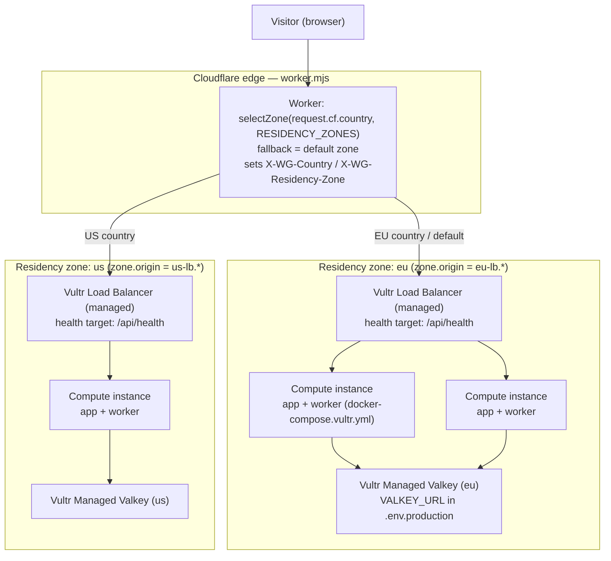
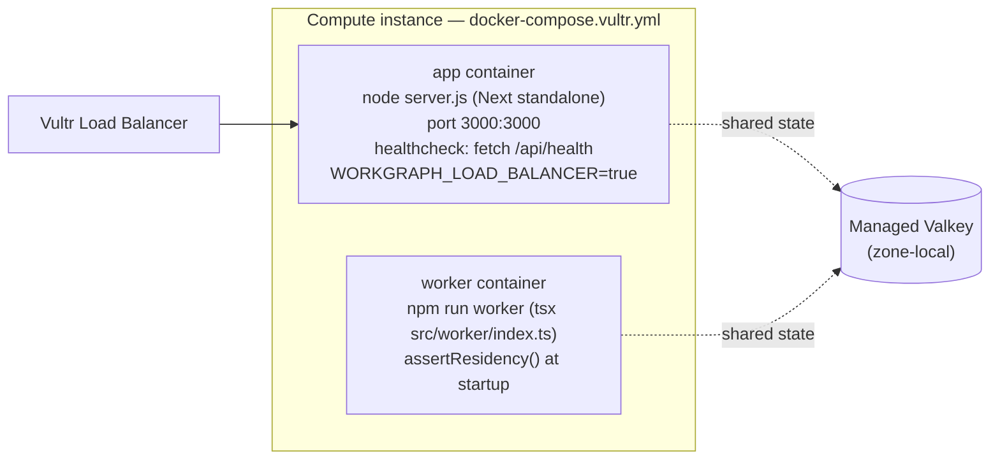
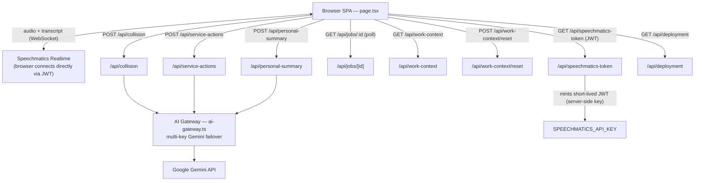
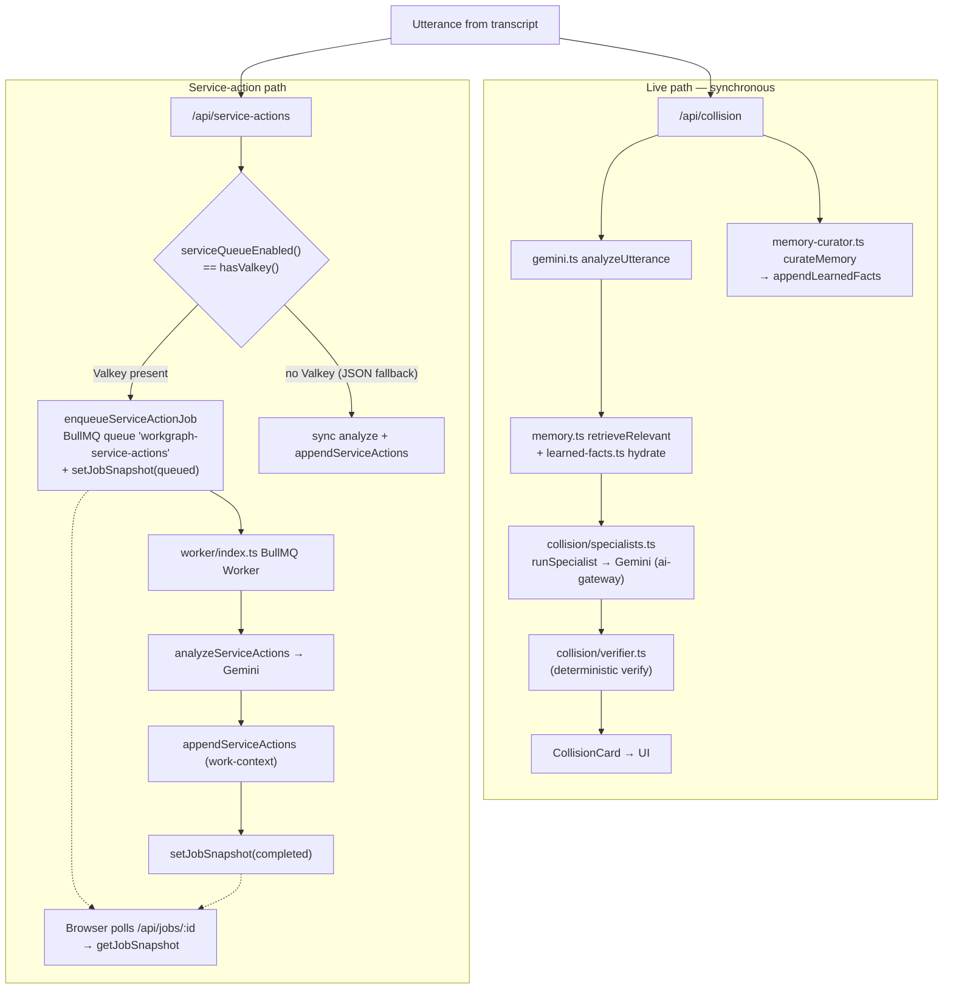
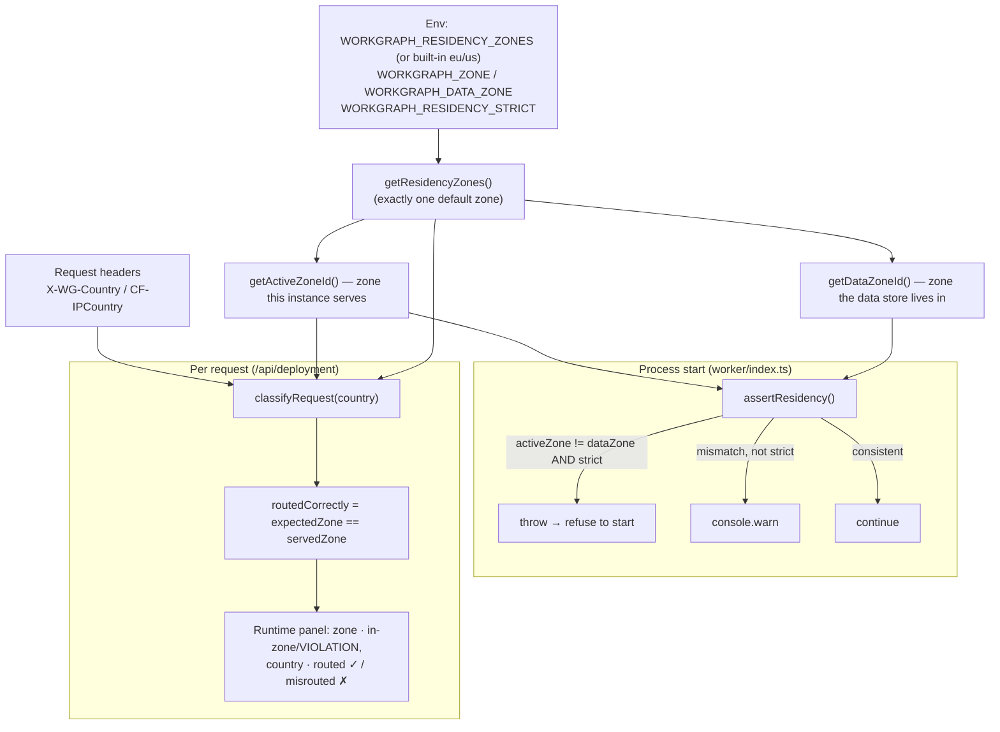

# System Architecture

> Derived **solely from code** at commit `14abecb` (`main`). Every node/edge
> below is backed by a cited source file. Nothing here is aspirational — if a
> component isn't in the repo, it isn't in the graph.

---

## 1. Multi-region topology (with load balancing)

Sources: `deploy/cloudflare/worker.mjs`, `deploy/cloudflare/wrangler.toml`,
`docker-compose.vultr.yml`, `src/lib/residency.ts`, `src/app/api/health/route.ts`.




Key code facts:

- **Cloudflare Worker is the geo-router**, not a balancer. `selectZone()`
(`worker.mjs`) maps `request.cf.country` (or the `CF-IPCountry` header) to a
zone and proxies to `https://<zone.origin>`; unknown/empty country → the
zone flagged `default` (else first). Zone list comes from the
`RESIDENCY_ZONES` Worker var (`wrangler.toml`).
- **The load balancer is Vultr's managed LB, one per zone** — it is *not* in
the repo as code (no nginx/haproxy service exists; `deploy/nginx` was
removed). Its health target is `/api/health`, which returns
`{ ok, time, service }` (`src/app/api/health/route.ts`).
- **Data residency = per-zone Valkey.** `docker-compose.vultr.yml` has **no
`valkey` service** — production Valkey is managed and supplied via
`.env.production` (`VALKEY_URL`), so each zone's data stays in that zone.

---

## 2. One Compute instance (the unit the Vultr LB balances)

Source: `docker-compose.vultr.yml`, `Dockerfile`, `package.json`.




- Both containers run the same image (`workgraph-ai`), share the
`x-residency` env anchor (`WORKGRAPH_ZONE`, `WORKGRAPH_DATA_ZONE`,
`WORKGRAPH_RESIDENCY_ZONES`, `WORKGRAPH_RESIDENCY_STRICT`) and
`.env.production`.
- `Dockerfile` builds Next.js `output: "standalone"` (`next.config.mjs`) and
runs `node server.js` on port 3000 as a non-root `nextjs` user.
- App is **stateless**; all cross-instance state lives in Valkey (§5), which
is what makes LB fan-out + multi-instance correct.

> Local dev variant: `docker-compose.yml` adds a `valkey/valkey:8-alpine`
> service, `VALKEY_URL=redis://valkey:6379`, `WORKGRAPH_LOAD_BALANCER=false`.

---

## 3. Request flow into the app

Sources: `src/app/page.tsx`, `src/hooks/useSpeechmatics.ts`,
`src/app/api/`**, `src/lib/ai-gateway.ts`.




- The browser hits these endpoints (verified `fetch(...)` calls in
`page.tsx` / `useSpeechmatics.ts`): `/api/speechmatics-token`,
`/api/work-context`, `/api/deployment`, `/api/collision`,
`/api/service-actions`, `/api/jobs/:id`, `/api/personal-summary`,
`/api/work-context/reset`.
- **Speechmatics audio never transits our server.** The browser fetches a
short-lived JWT from `/api/speechmatics-token` (server holds the API key)
then opens the realtime WebSocket directly to Speechmatics.
- **Gemini is always server-side**, behind the multi-key failover gateway
(`ai-gateway.ts`), used by `collision`, `service-actions`,
`personal-summary`, and `memory-curator` (`generateContent` callers).
- `/api/ai-gateway` (GET) exposes only the Gemini key-pool health (labels +
cooldown, never key values).

---

## 4. The two processing paths (live vs. queued)

Sources: `src/app/api/collision/route.ts`, `src/lib/gemini.ts`,
`src/lib/collision/specialists.ts`, `src/lib/collision/verifier.ts`,
`src/lib/memory-curator.ts`, `src/app/api/service-actions/route.ts`,
`src/lib/queue.ts`, `src/worker/index.ts`, `src/lib/runtime-store.ts`.




- The **only branch point** is `serviceQueueEnabled()` ===
`hasValkey()` === `VALKEY_URL` is set (`src/lib/queue.ts`,
`src/lib/valkey.ts`). With Valkey: enqueue + worker + poll. Without:
fully synchronous in the request, JSON-file persistence.
- The collision path is always synchronous (latency-critical) and runs the
specialist → verifier pipeline plus an async-style memory-curation call in
the same route.

---

## 5. State & storage

Sources: `src/lib/runtime-store.ts`, `src/lib/work-context.ts`,
`src/lib/learned-facts.ts`, `src/lib/queue.ts`, `src/lib/valkey.ts`.


| Data                      | When `VALKEY_URL` set                                                        | Fallback (no Valkey)                  |
| ------------------------- | ---------------------------------------------------------------------------- | ------------------------------------- |
| Completed service actions | Valkey list `workgraph:actions`                                              | `src/data/work-actions.runtime.json`  |
| Job status snapshots      | Valkey `workgraph:jobs:{id}` (TTL 24h)                                       | not tracked (sync mode)               |
| Service-action queue      | BullMQ queue `workgraph-service-actions`                                     | n/a (sync)                            |
| Learned facts             | Valkey (`learned-facts.ts` via `hasValkey()`)                                | `src/data/learned-facts.runtime.json` |
| Seed memory / context     | static `src/data/*.json` (`memory.json`, `people.json`, `work-context.json`) | same                                  |


- `valkey.ts` uses `ioredis`; `rediss://` URLs enable TLS (managed Valkey).
- `hasValkey()` (presence of `VALKEY_URL`) is the single switch that flips
every store above between Valkey and JSON-file mode.

---

## 6. Data-residency enforcement (app-side, defense in depth)

Sources: `src/lib/residency.ts`, `src/app/api/deployment/route.ts`,
`src/worker/index.ts`, `src/app/page.tsx` (Runtime panel),
`docker-compose.vultr.yml`.




- **Zones are config-driven**: `WORKGRAPH_RESIDENCY_ZONES` (validated JSON);
malformed/absent → built-in `eu` (default, EU+EEA countries) and `us`.
- **Startup guard**: `assertResidency()` runs in `worker/index.ts`; with
`WORKGRAPH_RESIDENCY_STRICT=true` (the `docker-compose.vultr.yml` default)
a data-store-in-wrong-zone condition **throws and the worker exits**.
- **Per-request verification**: `/api/deployment` re-derives the expected
zone from `CF-IPCountry`/`X-WG-Country` and reports `routedCorrectly` and
`consistent` — the app verifies the edge's routing instead of trusting it.

---

## 7. External dependencies (from code)


| Dependency            | How it's reached                                  | Source                                              |
| --------------------- | ------------------------------------------------- | --------------------------------------------------- |
| Cloudflare            | Worker geo-routes by `request.cf.country`         | `deploy/cloudflare/worker.mjs`                      |
| Vultr Load Balancer   | Managed, per zone; targets `/api/health`          | `docker-compose.vultr.yml`, `health/route.ts`       |
| Vultr Managed Valkey  | `ioredis` via `VALKEY_URL` (`rediss://` = TLS)    | `src/lib/valkey.ts`                                 |
| Speechmatics Realtime | Browser ↔ Speechmatics WS; JWT minted server-side | `useSpeechmatics.ts`, `speechmatics-token/route.ts` |
| Google Gemini         | Server-side, multi-key failover gateway           | `src/lib/ai-gateway.ts`                             |


---

## 8. Key environment variables (from `docker-compose.vultr.yml` + `residency.ts`)


| Var                                                          | Role                                                       | Default                                         |
| ------------------------------------------------------------ | ---------------------------------------------------------- | ----------------------------------------------- |
| `WORKGRAPH_ZONE`                                             | Zone this instance serves                                  | `eu`                                            |
| `WORKGRAPH_DATA_ZONE`                                        | Zone the data store lives in                               | `eu`                                            |
| `WORKGRAPH_RESIDENCY_ZONES`                                  | JSON zone topology                                         | built-in eu/us                                  |
| `WORKGRAPH_RESIDENCY_STRICT`                                 | Refuse start on cross-zone store                           | `true`                                          |
| `WORKGRAPH_LOAD_BALANCER`                                    | Reported in `/api/deployment`                              | `true` (vultr) / `false` (local)                |
| `VALKEY_URL`                                                 | Managed Valkey connection; flips all stores to Valkey mode | from `.env.production`                          |
| `SPEECHMATICS_API_KEY`                                       | Server-side key for JWT minting                            | from env                                        |
| `WORKGRAPH_RUNTIME` / `WORKGRAPH_REGION` / `WORKGRAPH_QUEUE` | Display metadata in `/api/deployment`                      | Vultr Cloud Compute / EU / Vultr Managed Valkey |


---

## 9. Source map

```
deploy/cloudflare/worker.mjs     edge geo-router (pure selectZone core)
deploy/cloudflare/wrangler.toml  zone topology (RESIDENCY_ZONES)
docker-compose.vultr.yml         per-instance prod stack (app + worker, no nginx, no valkey svc)
docker-compose.yml               local dev (adds valkey service)
Dockerfile                       Next standalone image, node server.js :3000
scripts/deploy-vultr.sh          build/up + waits app healthy + prints residency
src/lib/residency.ts             zones, classifyRequest, assertResidency
src/lib/valkey.ts                ioredis connection + hasValkey switch
src/lib/queue.ts                 BullMQ queue 'workgraph-service-actions'
src/lib/runtime-store.ts         Valkey keys: workgraph:actions, workgraph:jobs:{id}
src/lib/work-context.ts          actions store (Valkey or JSON fallback)
src/lib/learned-facts.ts         learned facts (Valkey or JSON fallback)
src/lib/ai-gateway.ts            multi-key Gemini failover
src/lib/gemini.ts                collision engine entry (analyzeUtterance)
src/lib/collision/specialists.ts specialist agents → Gemini
src/lib/collision/verifier.ts    deterministic card verification
src/lib/memory-curator.ts        curateMemory → learned facts
src/worker/index.ts              BullMQ worker; assertResidency() at startup
src/app/api/*                    health, deployment, collision, service-actions,
                                 jobs/[id], work-context(/reset), personal-summary,
                                 speechmatics-token, ai-gateway
src/app/page.tsx                 SPA + Runtime panel (residency/LB display)
```

